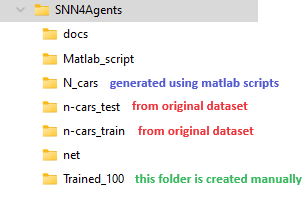

# SNN4Agents: A Framework for Developing Energy-Efficient Embodied Spiking Neural Networks for Autonomous Agents [will be updated soon]

SNN4Agents is a framework for enabling efficient embodied SNN deployments for autonomous agents. It consists of a set of optimization techniques for designing energy-efficient embodied SNNs targeting autonomous agent applications. Our SNN4Agents employs weight quantization, timestep reduction, and attention window reduction to jointly improve the energy efficiency, reduce the memory footprint, optimize the processing latency, while maintaining high accuracy. In the evaluation, we investigate use cases of event-based car recognition (i.e., NCARS dataset).

## Create Conda Environment (if required): 
```
conda create --name snn4agents python=3.8
```

## Installation: 
Ensure to fulfill the library requirements:
```
pip install numpy torch torchvision
```

## Preparation: 
Prepare the working folders as shown like this figure. 
<p align="left"></p>

To do this, first prepare the original N-CARS dataset (n-cars_test & n-cars_train), which can be downloaded from this [link](https://www.prophesee.ai/2018/03/13/dataset-n-cars/).

Then, generate the modified dataset (N_cars) using matlab scripts, which will create the N_cars folder.   

Afterwards, create "Trained_100" folder and run the example below.

## Example of command to run the code:
```
CUDA_VISIBLE_DEVICES=0 python3 main.py --filenet ./net/net_attwindow_100x100.txt --fileresult res_attwindow_100x100 --batch_size 40 --lr 1e-3 --lr_decay_epoch 20 --lr_decay_value 0.5 --threshold 0.4 --att_window 100 100 0 0 --sample_length 10 --sample_time 1 --wghbit_c0 32 --wghbit_c1 32 --wghbit_f0 32 --wghbit_f1 32 --quant 1 --tstep 20
```

## Citation
If you use SNN4Agents in your research or find it useful, kindly cite the following [article](https://www.frontiersin.org/article/10.3389/frobt.2024.1401677):
```
@ARTICLE{10.3389/frobt.2024.1401677,
	AUTHOR={Putra, Rachmad Vidya Wicaksana and Marchisio, Alberto and Shafique, Muhammad},   
	TITLE={SNN4Agents: A Framework for Developing Energy-Efficient Embodied Spiking Neural Networks for Autonomous Agents},      
	JOURNAL={Frontiers in  Robotics and AI},      
	VOLUME={11},       
	YEAR={2024}, 
	URL={https://www.frontiersin.org/articles/10.3389/frobt.2024.1401677},       
	DOI={10.3389/frobt.2024.1401677},      
	ISSN={2296-9144},
}
```
